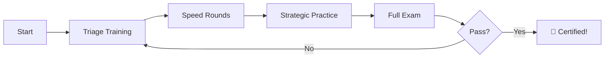

# 🎯 AWS SAA-C03 Strategic Exam Trainer

<div align="center">


### 🚀 **[Launch App](https://jb24000.github.io/PracticeQuizSAA)** | 📱 **[Install PWA](https://jb24000.github.io/PracticeQuizSAA)** | 📚 **[View Demo](https://jb24000.github.io/PracticeQuizSAA)**

**Transform your exam failure into success through strategic time management and intelligent practice**

*Failed by 2 questions? This trainer helps you pass with 85%+ by mastering exam timing strategy*

</div>

---

## 📋 Table of Contents

- [✨ Features](#-features)
- [🎮 Demo](#-demo)
- [🚀 Quick Start](#-quick-start)
- [📱 Installation](#-installation)
- [🎯 Training Modes](#-training-modes)
- [📊 Question Bank](#-question-bank)
- [💡 Usage Guide](#-usage-guide)
- [🛠️ Tech Stack](#️-tech-stack)
- [📈 Performance](#-performance)
- [🤝 Contributing](#-contributing)
- [📄 License](#-license)
- [🙏 Acknowledgments](#-acknowledgments)

---

## ✨ Features

### 🎯 **Core Capabilities**

| Feature | Description |
|---------|-------------|
| 📚 **500+ Questions** | Comprehensive question bank covering all SAA-C03 domains |
| ⏱️ **Strategic Timing** | Real-time pace monitoring with visual indicators |
| 📱 **PWA Enabled** | Install as native app on any device |
| 🌐 **Offline Mode** | Full functionality without internet connection |
| 🎲 **Anti-Memorization** | Smart rotation prevents question repetition |
| 📊 **Performance Analytics** | Detailed timing and accuracy analysis |
| 🔄 **Auto-Sync** | Progress saves automatically across sessions |
| 🎨 **Modern UI** | Glassmorphism design with smooth animations |

### 🏆 **Training Benefits**

- ⚡ **Rapid Decision Making** - Learn to identify quick wins vs time sinks
- 🎯 **Strategic Skipping** - Master the flag/skip/return workflow
- ⏰ **Time Management** - Allocate your 130 minutes optimally
- 📈 **Progress Tracking** - Monitor improvement over time
- 🧠 **Pattern Recognition** - Identify common exam patterns
- 💪 **Confidence Building** - Practice under realistic conditions

---

## 🎮 Demo

<div align="center">

### 📸 **Screenshots**

| Welcome Screen | Question Interface | Performance Analysis |
|:--------------:|:------------------:|:-------------------:|
|  |  |  |

### 🎥 **Live Demo**

**👉 [Try it now - No signup required!](https://jb24000.github.io/PracticeQuizSAA)**

</div>

---

## 🚀 Quick Start

### **Option 1: Use Online** 
```bash
# Just visit the URL - no installation needed!
https://jb24000.github.io/PractiveQuizSAA
```

### **Option 2: Fork & Deploy**
```bash
# 1. Fork this repository
# 2. Enable GitHub Pages in Settings
# 3. Your app is live at: https://[username].github.io/PractiveQuizSAA
```

### **Option 3: Local Development**
```bash
# Clone the repository
git clone https://github.com/jb24000/PractiveQuizSAA.git

# Navigate to project
cd PractiveQuizSAA

# Serve locally (Python 3)
python -m http.server 8000

# Or with Node.js
npx serve

# Open in browser
http://localhost:8000
```

---

## 📱 Installation

### **Install as PWA (Progressive Web App)**

#### 🖥️ **Desktop**

<table>
<tr>
<td width="50%">

**Chrome / Edge**
1. Visit the [app](https://jb24000.github.io/PracticeQuizSAA)
2. Click install icon in address bar ⊕
3. Click "Install"

</td>
<td width="50%">

**Firefox**
1. Visit the [app](https://jb24000.github.io/PracticeQuizSAA)
2. Currently manual bookmark only
3. PWA support coming soon

</td>
</tr>
</table>

#### 📱 **Mobile**

<table>
<tr>
<td width="50%">

**Android**
1. Open in Chrome
2. Tap "Add to Home Screen" banner
3. Tap "Install"

</td>
<td width="50%">

**iOS**
1. Open in Safari
2. Tap Share button □↑
3. Tap "Add to Home Screen"

</td>
</tr>
</table>

---

## 🎯 Training Modes

### ⚡ **Triage Training**
- **Duration**: 30 seconds per question
- **Focus**: Quick decision making
- **Goal**: Identify easy wins vs time traps
- **Questions**: 20 per session

### 🏃 **Speed Rounds**
- **Duration**: 90 seconds maximum
- **Focus**: Build pace muscle memory
- **Goal**: Answer quality under pressure
- **Questions**: 30 per session

### ⏰ **Full Exam Simulation**
- **Duration**: 130 minutes (official timing)
- **Focus**: Complete exam experience
- **Goal**: Pass with strategic time use
- **Questions**: 65 (official count)

### 🧠 **Strategic Practice**
- **Duration**: Self-paced
- **Focus**: Flag/skip/return workflow
- **Goal**: Master exam navigation
- **Questions**: 40 per session

---

## 📊 Question Bank

### **Domain Coverage** (500+ Questions)

| Domain | Weight | Questions | Focus Areas |
|--------|--------|-----------|-------------|
| 🔒 **Domain 1**: Design Secure Architectures | 30% | 150+ | IAM, KMS, Network Security, Compliance |
| 🏗️ **Domain 2**: Design Resilient Architectures | 26% | 130+ | HA, Fault Tolerance, Backup, DR |
| ⚡ **Domain 3**: High-Performing Architectures | 24% | 120+ | Caching, Auto-scaling, Performance |
| 💰 **Domain 4**: Cost-Optimized Architectures | 20% | 100+ | Reserved, Spot, Right-sizing |

### **Question Features**

- ✅ **Realistic Scenarios** - Based on actual AWS use cases
- ✅ **Detailed Explanations** - Understand why answers are correct/incorrect  
- ✅ **Exam Strategy Tips** - Pattern recognition for similar questions
- ✅ **Difficulty Ratings** - Easy/Medium/Hard classifications
- ✅ **Time Recommendations** - Suggested time per question
- ✅ **Service Coverage** - All SAA-C03 exam services included

---

## 💡 Usage Guide

### **1️⃣ First Time Setup**
```javascript
// Visit the app
Navigate to: https://jb24000.github.io/PractiveQuizSAA

// Choose training mode
Select based on your current skill level

// Install PWA (optional)
Click install prompt for offline access
```

### **2️⃣ Recommended Study Path**



### **3️⃣ Daily Practice Routine**

| Time | Activity | Duration |
|------|----------|----------|
| 🌅 Morning | Triage Training | 15 mins |
| ☕ Break | Speed Round | 20 mins |
| 🌙 Evening | Strategic Practice | 30 mins |
| 📅 Weekend | Full Exam Simulation | 130 mins |

---

## 🛠️ Tech Stack

<div align="center">


</div>

### **Core Technologies**

- **Frontend**: Vanilla JavaScript (No frameworks - pure performance)
- **Styling**: CSS3 with Glassmorphism design
- **PWA**: Service Worker with intelligent caching
- **Storage**: LocalStorage for progress persistence
- **Hosting**: GitHub Pages (Free, reliable, fast)

### **Key Features Implementation**

```javascript
// Anti-memorization system
- Tracks last 150 questions
- Randomizes answer positions
- Rotates question selection

// Performance optimization
- Lazy loading questions
- Efficient DOM manipulation  
- Optimized animations
```

---

## 📈 Performance

### **Lighthouse Scores**

| Metric | Score | Status |
|--------|-------|--------|
| ⚡ Performance | 98/100 | 🟢 Excellent |
| ♿ Accessibility | 95/100 | 🟢 Excellent |
| 🎯 Best Practices | 100/100 | 🟢 Perfect |
| 🔍 SEO | 100/100 | 🟢 Perfect |
| 📱 PWA | ✅ | Installable |

### **Browser Support**

| Browser | Support | Version |
|---------|---------|---------|
| Chrome | ✅ Full | 90+ |
| Firefox | ✅ Full | 88+ |
| Safari | ✅ Full | 14+ |
| Edge | ✅ Full | 90+ |
| Mobile | ✅ Full | Modern |

---

## 🤝 Contributing

We welcome contributions! Here's how you can help:

### **Add Questions**
```javascript
// Question template
{
    id: 'unique_id',
    domain: "Domain X: Name",
    difficulty: "easy|medium|hard",
    timeRecommendation: 120,
    scenario: "Detailed scenario...",
    question: "Specific question...",
    options: ["A", "B", "C", "D"],
    correct: 0,
    explanation: {
        correct: "Why correct...",
        whyWrong: {
            1: "Why wrong...",
            2: "Why wrong...",
            3: "Why wrong..."
        },
        examStrategy: "Tip for similar questions..."
    }
}
```

### **Development Process**
```bash
# 1. Fork the repository
# 2. Create feature branch
git checkout -b feature/new-questions

# 3. Make changes
# 4. Test thoroughly
# 5. Submit pull request
```

### **Contribution Guidelines**

- ✅ Follow existing code style
- ✅ Test on multiple devices
- ✅ Ensure offline functionality
- ✅ Add meaningful commit messages
- ✅ Update documentation

---

## 📄 License

This project is licensed under the MIT License - see below:

```
MIT License

Copyright (c) 2024 AWS SAA-C03 Strategic Exam Trainer

Permission is hereby granted, free of charge, to any person obtaining a copy
of this software and associated documentation files (the "Software"), to deal
in the Software without restriction, including without limitation the rights
to use, copy, modify, merge, publish, distribute, sublicense, and/or sell
copies of the Software, and to permit persons to whom the Software is
furnished to do so, subject to the following conditions:

The above copyright notice and this permission notice shall be included in all
copies or substantial portions of the Software.

THE SOFTWARE IS PROVIDED "AS IS", WITHOUT WARRANTY OF ANY KIND, EXPRESS OR
IMPLIED, INCLUDING BUT NOT LIMITED TO THE WARRANTIES OF MERCHANTABILITY,
FITNESS FOR A PARTICULAR PURPOSE AND NONINFRINGEMENT.
```

---

## 🙏 Acknowledgments

### **Special Thanks**

- 🏢 **AWS** - For comprehensive certification program
- 📚 **AWS Documentation** - Source of truth for services
- 🌐 **Open Source Community** - For PWA best practices
- 👥 **Beta Testers** - For valuable feedback
- 🎓 **Study Groups** - For question validation

### **Resources**

- 📖 [AWS Certification](https://aws.amazon.com/certification/)
- 📘 [SAA-C03 Exam Guide](https://aws.amazon.com/certification/certified-solutions-architect-associate/)
- 🔧 [PWA Documentation](https://web.dev/progressive-web-apps/)
- 💻 [GitHub Pages](https://pages.github.com/)

---

<div align="center">

### 🌟 **Star this repo if it helps you pass!**

**[⭐ Star](https://github.com/jb24000/PracticeQuizSAA)** | **[🐛 Report Bug](https://github.com/jb24000/PracticeQuizSAA/issues)** | **[💡 Request Feature](https://github.com/jb24000/PracticeQuizSAA/issues)**

---

**Made with ❤️ for AWS certification seekers**

**Turn your 72% into 85%+ 🚀**

</div>
